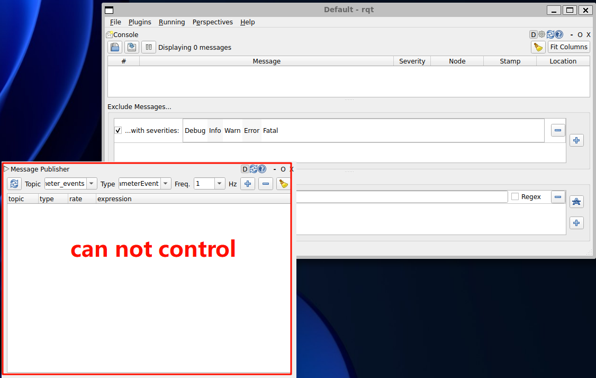

When using rqt in Windows wsl and accidentally move the panel out of main window, the panel will no longer controllable.



## Solution

- Close the rqt window
- Navigate to ROS config directory

  ```console
  cd ~/.config/ros.org/
  ```

- Remove the rqt windows config file

  ```console
  rm rqt_gui.inicon
  ```

- Restart the rqt

  ```console
  rqt
  ```

  


## Reference

[https://stackoverflow.com/questions/76049607/rqt-graph-in-ros2-is-corrupted-after-maximizing-it](https://stackoverflow.com/questions/76049607/rqt-graph-in-ros2-is-corrupted-after-maximizing-it)

