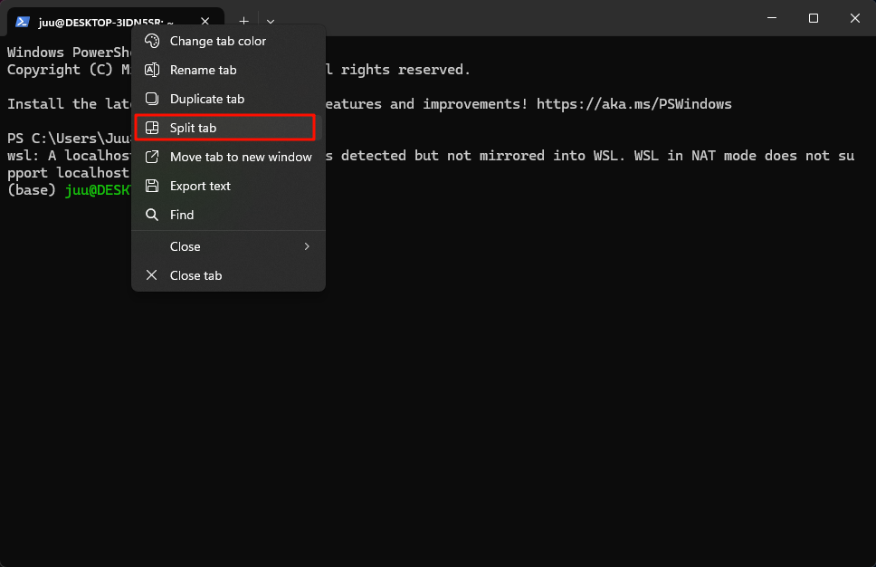
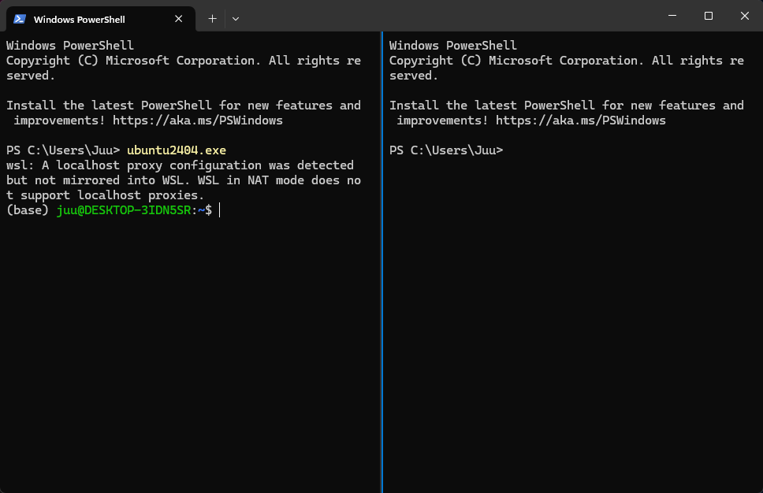
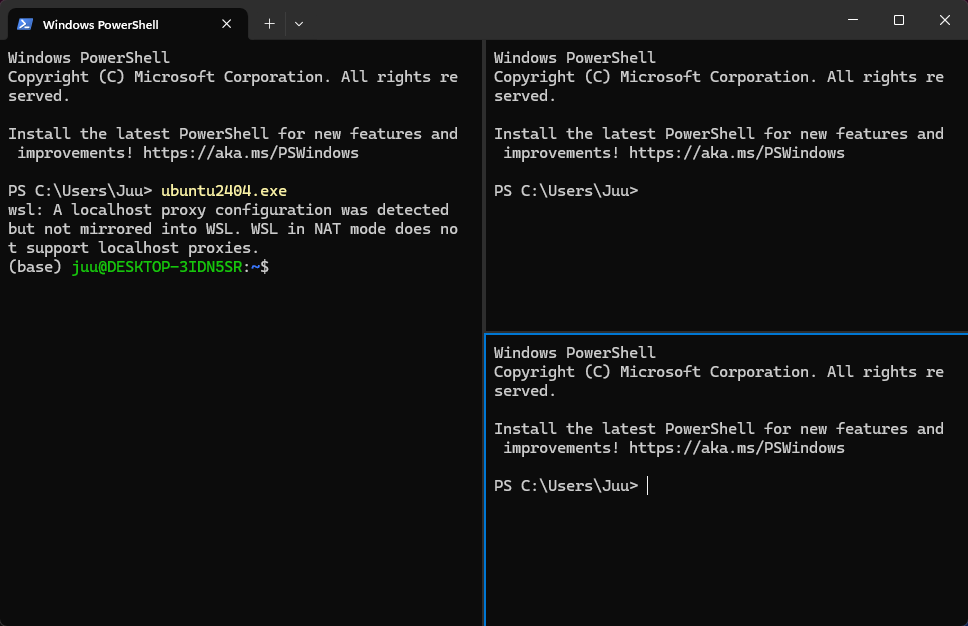

WIndows termial seems have a big update. We could split the Windows terminal tab instead of open multiply tabs. This feature comined with wsl would have a lot of beneifts.

## Split the tab

- RIght click the tag
- Choose "Split tab"

Then the tag is splited

It will create a panel on the left

Chooseing the panel then continue to split could generate a up down layout panel

### Shortkey

- Vertical split:`Alt + Shift + +`
- Horizontal split: `Alt + Shift + -`

## Close the panel

Activating the panel then press : `Ctrl + Shift + W`

## Tips

- Command manual: Pressing `Ctrl + Shift + p` could open command manula, ther are many command and coressponding shortkeys
- It seems that the panel could not resize. So we must adjust the window size before spilit

## Reference

https://learn.microsoft.com/en-us/windows/terminal/panes

