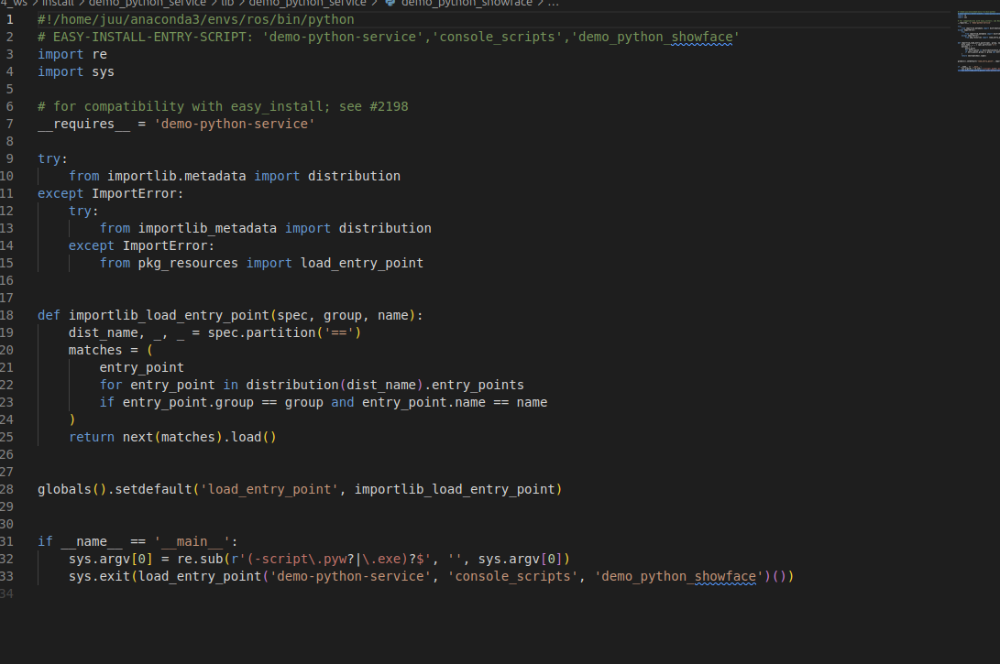

Creating a virtual environment to develop pythons seems trivial, however it becomes quiet difficult to manage ROS2 python packages using virtual environment. This article demonstrates how to use `conda` to manage ROS2 python packages.

## Praparing conda virtual environment

- Creating a conda virtual environment

  ```bash
  conda create -n your_environment_name python=3.12.3
  ```

  Replacing  `your_environment_name` to the name that you want to assign to the virtual environment. You could also change the python version as you needed.

- **activate the virtual environment and install** **`colcon`** **colcon** **colcon**

  ```bash
  conda activate your_environment_name
  pip install rospkg
  pip install -U colcon-common-extensions
  ```

  Installing colcon in your virtual environment is very important! It will automatically change the shebang setting to use the virtual environment


## Compile the ROS2 packages

Going to your ROS2 workplace, then running:

```bash
python -m colcon build
```

Using `python -m` instead of direction using `colcon` make sure that your virtual environment is used when compiling and running.

Add any parameters as you need like: `--packages-select`, `--symlink-install`.

## Source the packages and run

Source your packages and run it:

```bash
source install/setup.bashrc
ros2 run your_package your_nodes

```

The python in your virtual environment will be used to execute the code.

## A little more explain

When using ros2 run command to run a python file, a script in `install/your_packages_name/lib/your_packages_name/the_entries_name` will be executed.

the script looks like:



The first line is shebangs, which specify the python to execute the code.

If you uses `colcon` (instead of `python -m colcon`) to compile the package, the first line usually has default: `#!/usr/bin/python`. 

You can also manually change this line to specific python path that you want to run, but it will change to default value every time you use `colcon`.

## Reference

[https://colcon.readthedocs.io/en/released/user/installation.html](https://colcon.readthedocs.io/en/released/user/installation.html)