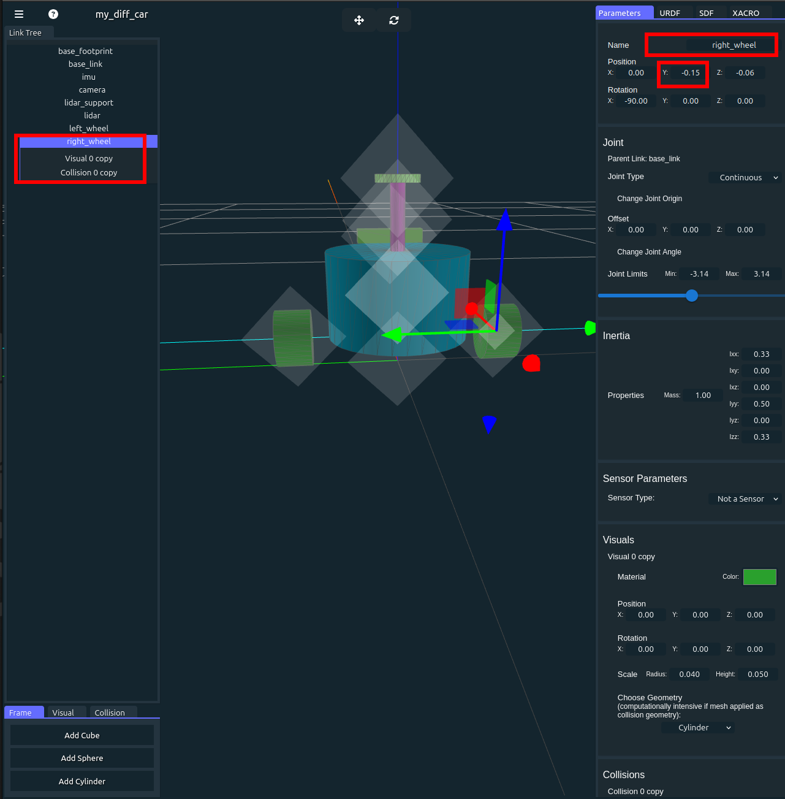
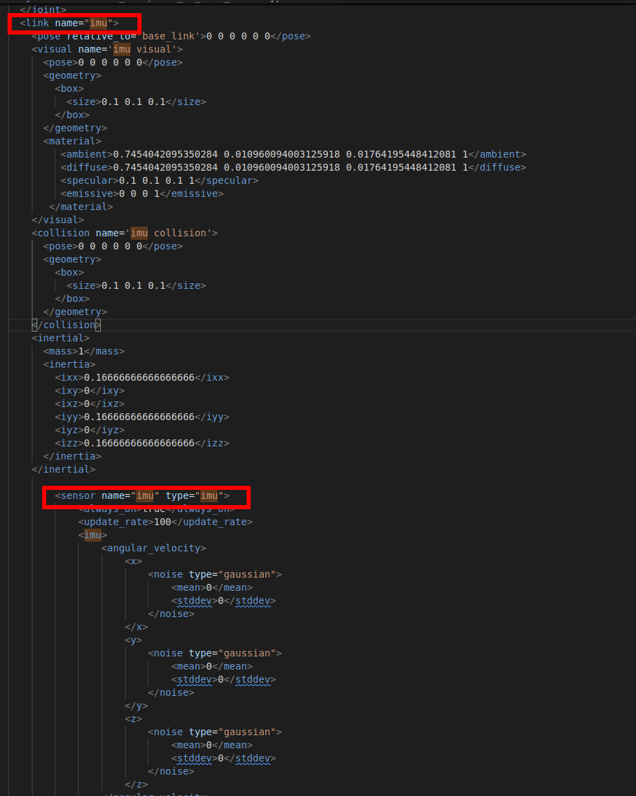
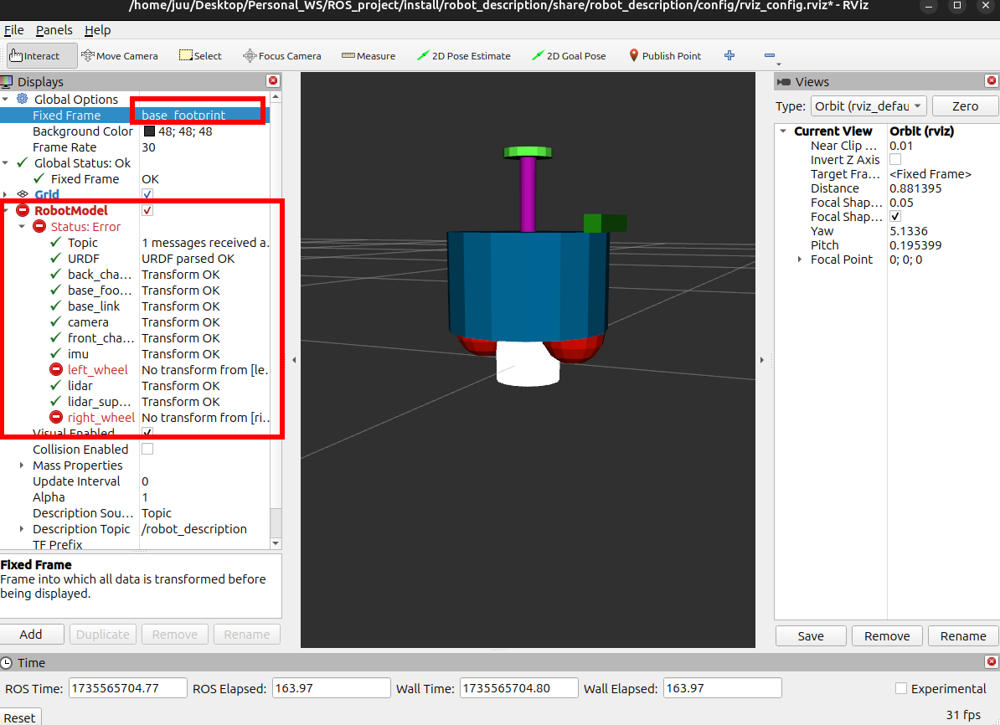

## Introduction

Differential car is a common structure in robot base. There are extended tutorial ranging from modeling to simulation using ROS2 and related tools. However, these tutorial mainly using Gazebo classic, an obsolete version of simulator. Though Gazebo has been updated to Ionic and introduced many new features, seldom tutorial introduce complete workflow from building a differential car model, adding control plugins, loading model to Gazebo, visualize model in Rviz and control the model by publishing topics OR using game pad.

This tutorial introducing a complete workflow, allowing to simulate a differential car model in Gazebo Harmonic. No hardware is requested in this tutorial, but you can add hardware easily later. The tutorial introduced three control method and corresponding templates, the syllabus is shown below.


The software used are listed below:

| Software     | Version                       |
| ------------ | ----------------------------- |
| OS           | Ubuntu 24.04                  |
| ROS          | Jazz Jalisco                  |
| ros2_control | 4.20.0-1noble.20241118.193738 |
| Gazebo       | Harmonic                      |
| Rviz         | 14.1.5-1noble.20241115.194822 |

Source code could be found [here](https://github.com/JuuHuu/ROS_DiffCar_example)
## Modeling

### Section overview


What we are doing is framed with dashed red line, what we have done are colored, what we haven't done are grey.

In this section, we wil build a differential drive car model with a IMU sensor, a lidar, and a depth camera. The structure is identical to the model provide by [FishROS](https://fishros.com/d2lros2/).

The robot we will create looks like:


It has structure like:


### Tools

- [URDF Creator](https://lever-robotics.github.io/URDF_creator/)
- [URDF Checker](https://gkjohnson.github.io/urdf-loaders/javascript/example/bundle/index.html)
- VS code

### Steps

#### Creating ROS2 robot description packages

We usually separate the robot description and robot control packages for better scalability and reusability. First creating a robot description, in your ROS2 workspace root folder, run:

```bash
ros2 pkg create robot_description --build-type ament_cmake --destination-directory src
```

We create a package named robot_description in the src folder. you workspace should has structure:


Open VS code in your ROS2 workspace:

```bash
code .
```

Creating a `sdf`, and `launch` folder under `robot_description` folder, you will get following file structure in vscode:  


the `sdf` folder will be used to store robot description file and the `launch` folder will be used to launch Rviz preview.

#### Creating the robot description file on URDF Creator webpage

[URDF creator](https://lever-robotics.github.io/URDF_creator/) is a open source webpage application created by lever robotics, it can import almost all 3D models and output URDS ,SDF file or entire robot description ros2 packages. It can also modeling simple robot structure on the webpage.

#### Start the project


  
Close the welcome page, the web app automatically create a `base_footprint` for us:  


  
Get familiar with the webpage and we will start create the robot.

#### Rename the robot
Rename the robot on the right top.  


#### Add base link
Add a cylinder as base link, drag and put it under `base_footprint` in Link Tree panel. We change the following parameters and keep other default. Attention that we have to change both `visual` and `collision` cylinder's radius and height, the screenshot below does not show collisions' size.

| Feature     | Value |
| ----------- | ----- |
| Radius      | 0.1   |
| Height      | 0.12  |
| Position, z | 0.1   |
| Mass        | 200   |


There will be a cylinder base lik in the screen, check URDF and SDF on the right panel, there has been some automatically generated code.

#### Save the project file

To save the file we have currently create, click the up right three bar -> Export -> Save Project, and Export a GLTF file. It will create a GLTF file that save our project and reopen to continue the job.

#### Add imu sensor
Add a cube link as imu, drag and put it under `base_link`, changing following parameters:
| Feature     | Value |
| ----------- | ----- |
| Name        | imu   |
| Position, x | 0     |
| Position, y | 0     |
| Position, z | 0     |
| Scale, x    | 0.1   |
| Scale, y    | 0.1   |
| Scale, z    | 0.1   |
| Sensor Type | IMU   |

We hide the `imu` link inside the `base_link`, so we cannot see it directly. But check out the URDF or SDF code, we could find the imu link. Also, we set the sensor type as IMU, and till i write this blog, there are some bugs in the web: after choosing sensor type as IMU, it will not show immediately, unless you switch to other tags then switch back to Parameters tag.


#### Add camera sensor
Add a cube link as `camera`, drag and put it under `base_link`, changing following parameters:
| Feature     | Value  |
| ----------- | ------ |
| Name        | camera |
| Position, x | 0.1    |
| Position, y | 0      |
| Position, z | 0.07   |
| Scale, x    | 0.02   |
| Scale, y    | 0.1    |
| Scale, z    | 0.02   |
| Sensor Type | Camera |


#### Add lidar support
Though we can directly make lidar floating, we still add a lidar support to make the robot more reasonable. Add a cylinder link as `lidar_support`, drag and put it under `base_link`, changing following parameters:
| Feature       | Value         |
| ------------- | ------------- |
| Name          | lidar_support |
| Position, x   | 0             |
| Position, y   | 0             |
| Position, z   | 0.1           |
| Scale, Radius | 0.01          |
| Scale, Height | 0.1           |


#### Add lidar sensor
Add a cylinder link as `lidar`, drag and put it under `base_link`, changing following parameters:
| Feature       | Value |
| ------------- | ----- |
| Name          | lidar |
| Position, x   | 0     |
| Position, y   | 0     |
| Position, z   | 0.05  |
| Scale, Radius | 0.03  |
| Scale, Height | 0.01  |
| Sensor Type   | Lidar |


#### Add left wheel
Add a cylinder link as `left_wheel`, drag and put it under `base_link`. Since the default cylinder is oriented vertically upwards, we need to rotate it to a horizontal orientation. The different rotation direction will cause the original z-axis to face left or right:

The left and right cylinder in the picture has different forward direction. When both cylinder(wheel) rotate along z-axis in counter clockwise, the left cylinder will going into the screen, and the right cylinder will going out the screen. That is when we send forward command to the car it may going backwards. To avoid this, make sure after rotation, the original z-axis is the same direction as y-axis. Usually, in 3D software, three axis have different color: Red - X, Green - Y, Blue - z. So make sure the original z-axis of wheel have the same direction as green axis shown in the app.

If you don't understand above, just changing following parameters:
| Feature       | Value      |
| ------------- | ---------- |
| Name          | left_wheel |
| Position, x   | 0          |
| Position, y   | 0.15       |
| Position, z   | -0.06      |
| Scale, Radius | 0.04       |
| Scale, Height | 0.05       |
| Joint Type    | Continuous |


#### Add right wheel
Add a cylinder link as `right_wheel`, drag and put it under `base_link`.You may find that the left and right wheel have the same parameters except the position y and the name, so we can duplicated lef wheel in Link Tree on the left panel and change these two parameters. Or you can changing following parameters if you build a new right wheel:
| Feature         | Value           |
| --------------- | --------------- |
| **Name**        | **right_wheel** |
| Position, x     | 0               |
| **Position, y** | **-0.15**       |
| Position, z     | -0.06           |
| Scale, Radius   | 0.04            |
| Scale, Height   | 0.05            |
| Joint Type      | Continuous      |



#### Add front chaster
we need two chaster to make the car balance. Add a sphere ling as `front_chaster`, drag and put it under `base_link`.changing following parameters:
| Feature       | Value         |
| ------------- | ------------- |
| Name          | front_chaster |
| Position, x   | 0.06          |
| Position, y   | 0             |
| Position, z   | -0.06         |
| Scale, Radius | 0.04          |


#### Add back chaster
we need two chaster to make the car balance. Add a sphere ling as `back_chaster`, drag and put it under `base_link`.changing following parameters:
| Feature         | Value            |
| --------------- | ---------------- |
| **Name**        | **back_chaster** |
| **Position, x** | **-0.06**        |
| Position, y     | 0                |
| Position, z     | -0.06            |
| Scale, Radius   | 0.04             |


#### Save the project and sdf file
Save the project file by clicking three bars on the up right and choose `Export`. Then `Save Project`.


Creating a `.sdf` file under sdf folder in vscode, then paste all sdf content from the web app


#### Check the model
You have finished the modeling! But before use the model, we will do a final check to avoid potential mistakes in the model.

Export the model as `URDF` file, then use Chrome browser open the urdf check [website](https://gkjohnson.github.io/urdf-loaders/javascript/example/bundle/index.html). Drag and drop the URDF file into the page. You will see our model is loaded and two wheels are controllable.


Congratulations! You build a differential car. We will modifying the car in the next section to fit the new Gazebo.

## Modifying
### Section overview
In last section, we have created a differential car and generate `.sdf` file. Unfortunately, the `.sdf` file is generated to load in old version of Gazebo. In this section, we will modify the `.sdf` file to compatible with Gazebo Harmonic, the newest LTS version.


### Tools
VS code

### Steps
We will add a `Diff control` plugin, modify the `joint state publisher` plugin and `sensor` in sdf file. The `Diff control` plugin allow us to control the car, `joint state publisher` auto publish the joint state from Gazebo, and `sensor` publish sensor date from Gazebo.

#### Check the sdf file
Check the .sdf file, we will find that some sensor tag are added to corresponding link, searching imu in the .sdf file we will find that a sensor named imu is added under imu link. Check other sensor tag in the file by yourself.


We also find that at the end of .sdf file, there is a `joint_state_publisher` plugin, which will publish the joint state in Gazebo.


The automatically generated plugin was designed to work in Gazebo classic. The detailed explanation can be found in [official documents](https://gazebosim.org/docs/latest/migrating_gazebo_classic_ros2_packages/). You can also find some useful information about migration sensor plugin to Gazebo Harmonic. 

#### Modify the pose
At the beginning of .sdf file, we could find:
```xml
<pose relative_to='world'>0 0 0 0 0 0</pose>
```
Just delete it for compatibility.

#### Modify the joint state publisher plugin
Going to the end of `.sdf` file, changing the plugin code to the following to use in Gazebo Harmonic:

```xml
<plugin name="gz::sim::systems::JointStatePublisher" filename="gz-sim-joint-state-publisher-system">
    <topic>joint_states</topic>
    <joint_name>base_link_to_right_wheel</joint_name>
    <joint_name>base_link_to_left_wheel</joint_name>
</plugin>
```
the `topic` tag assign the joint state publish topic and `joint_name` assign which joint information we will publish in Gazebo. Since other joints are fixed, we only need to publish the wheel joints. Make sure the joint name is identical to your `.sdf` file.

#### Modify imu sensor
Search `sensor` in .sdf file, find codes related to `imu`. We will find that in imu's sensor tag, there is a plugin named `imu_plugin_for_imu`, and file name `libgazebo_ros_imu_sensor.so` (you may have different plugin name, but the filename should be the same):
```xml
<plugin name="imu_plugin_for_imu" filename="libgazebo_ros_imu_sensor.so">
    <ros>
        <remapping>~/out:=imu/imu</remapping>
    </ros>
</plugin>
```
this plugin is used in Gazebo classic to publish imu date. We will handel the sensor date in a world plugin in Gazebo Harmonic. So:
1. delete the imu `plugin` code here.
2. Also add a `topic` tag under sensor tag to assign the gazebo imu topic:
```xml
<topic>imu</topic>
```

The final code related to imu sensor is (for simplicity we've omitted the content in imu tag):
```xml
      <sensor name="imu" type="imu">
        <always_on>true</always_on>
        <update_rate>100</update_rate>
        **<topic>imu</topic>**
        <imu>
            XXXXXXXXXXXXXXXXXXXX
            XXXXXXXXXXXXXXXXXXXx
            ......
        </imu>
      </sensor>
```

#### Modify camera sensor
Search `sensor` in .sdf file, find codes related to `camera`. We will find sensor tag related to camera and it's plugin.

To make the robot more functional, we will use a depth camera. So:
1. change the sensor type to `rgbd_camera`, 
2. add a `topic` tag under sensor to assign the camera date topic
3. for the same reason, delete the `plugin` tag under sensor
4. Add `gz_frame_id` under sensor for new Gazebo
5. add `camera_info_topic` under camera tag for new Gazebo

The final code related to camera sensor is:
```xml
<sensor name="camera_camera" type="rgbd_camera">
    <always_on>true</always_on>
    <visualize>true</visualize>
    <update_rate>100</update_rate>
    <topic>camera</topic>
    <gz_frame_id>camera</gz_frame_id>
    <camera name="camera_camera">
        <camera_info_topic>camera/camera_info</camera_info_topic>
        <horizontal_fov>1.3962634</horizontal_fov>
        <image>
        <width>800</width>
        <height>600</height>
        <format>R8G8B8</format>
        </image>
        <clip>
        <near>0.1</near>
        <far>100</far>
        </clip>
        <noise>
        <type>gaussian</type>
        <mean>0</mean>
        <stddev>0.007</stddev>
        </noise>
    </camera>
</sensor>
```

#### Modify lidar sensor
Search `sensor` in .sdf file, find codes related to `lidar`. We will find sensor tag related to lidar and it's plugin.
To use the lidar sensor in new Gazebo, change following:
1. change sensor type to `gpu_lidar`
2. add a `topic` tag under sensor
3. delete the `plugin` tag under sensor
4. Add `gz_frame_id` under sensor
5. change `ray` tag to `lidar`

The final code related to lidar sensor is:
```xml
<sensor name="lidar_lidar" type="gpu_lidar">
    <always_on>true</always_on>
    <visualize>true</visualize>
    <pose>-0.064 0 0.121 0 0 0</pose>
    <update_rate>5</update_rate>
    <topic>scan</topic>
    <gz_frame_id>lidar</gz_frame_id>
    <lidar>
        <scan>
        <horizontal>
            <samples>360</samples>
            <resolution>1</resolution>
            <min_angle>0</min_angle>
            <max_angle>6.28</max_angle>
        </horizontal>
        </scan>
        <range>
        <min>0.12</min>
        <max>3.5</max>
        <resolution>0.015</resolution>
        </range>
        <noise>
        <type>gaussian</type>
        <mean>0</mean>
        <stddev>0.01</stddev>
        </noise>
    </lidar>
</sensor>
```
#### Add Differential drive plugin
We want to use a differential drive to control our car, to do this, add a differential drive plugin under inside `model` tag , alone side the joint state publisher plugin:
```xml
<plugin filename="gz-sim-diff-drive-system" name="gz::sim::systems::DiffDrive">
    <left_joint>base_link_to_left_wheel</left_joint>
    <right_joint>base_link_to_right_wheel</right_joint>
    <wheel_separation>0.3</wheel_separation>
    <wheel_radius>0.04</wheel_radius>
    <max_linear_acceleration>0.033</max_linear_acceleration>
    <odom_topic>odom</odom_topic>
    <topic>cmd_vel</topic>
    <frame_id>odom</frame_id>
    <child_frame_id>base_footprint</child_frame_id>
    <odom_publisher_frequency>30</odom_publisher_frequency>
    <tf_topic>/tf</tf_topic>
</plugin>
```
The plugin will run in gazebo to receive control command and publish odom information. Make all joints name, frames name and wheel parameters set here is identical to your car.

Till now, we have completed our car model. Before we moving on, we will check the model again. We are going to load the model into the Rviz to do some final check.

#### Check in Rviz
1. Build a .py file in the `launch` folder, the file name could be `preview.launch.py`. 
2. To store the Rviz config file in the future, we could also create a `config` folder along side launch folder.


The `.launch.py` file should have following content:
```python
import launch
import launch_ros
from ament_index_python.packages import get_package_share_directory


def generate_launch_description():
    robot_description_path = (
        get_package_share_directory("robot_description") + "/sdf/my_diff_car.sdf"
    )
    rviz_config_path = (
        get_package_share_directory("robot_description") + "/config/rviz_config.rviz"
    )

    return launch.LaunchDescription(
        [
            launch_ros.actions.Node(
                package="robot_state_publisher",
                executable="robot_state_publisher",
                output="screen",
                parameters=[{"robot_description": open(robot_description_path).read()}],
            ),
            launch_ros.actions.Node(
                package="rviz2",
                executable="rviz2",
                arguments=["-d", rviz_config_path],
            ),
        ]
    )

```
We read the sdf file content and publish it.

3. Edit the `CmakeLists.txt` file to install our sdf model and launch file, add this under find_package:

```cmake
install(DIRECTORY launch config sdf
  DESTINATION share/${PROJECT_NAME})
```
4. compile the project using `colcon`. Open the terminal under project workspace:

```bash
colcon build --symlink-install
```
here we use symlink install for convince.

5. source the bash and launch the Rviz:
```bash
source install/setup.bash
ros2 launch robot_description preview.launch.py
```

You will find Rviz is launch and nothing appears. We need to manually add robot to the Rviz. Click Add at left bottom -> RobotModel 

Then expand RobotModel, choose Description Source as Topic and set the Topic as robot_description.


The robot still does not show correctly, since we choose wrong Fixed Frame. Select Fixed Frame as base_footprint, the robot should show with Error.

Two wheel does not show correctly, it is ok since we do not publish any wheel information. We will fix it after launch Gazebo.

It is tedious to set the Robot Model and choose Fixed Frame manually every time. Lucky, we have already set the rviz config file when launch. So save the current Rviz config to our config folder. 
Select `File` on up left, then `save Config As` choose the config folder and name as `rviz_config.rviz`. The file name should correspond to our launch file.

Since we use symlink-install, we do not need compile again. Launch the launch file, then Robot model is loaded automatically.

We finally made it! the robot model all set. And we will load the robot into Gazebo.

## Config ros_gz_bridge
### Section overview

Before loading and simulating the model in gazebo, we should add a bridge between ROS2 and Gazebo. We config all the plugin and sensor before to fit gazebo, and all the date is published in Gazebo, to read these sensor date in ROS2 we should transfer the date from Gazebo to ROS2. ros_gz_bride is designed to do thar for us. 

In this section we will setup simulation packages and setup bridge config file.

### Tools
vscode

### Steps
#### Build simulation package
1. Create a separate ros2 package for simulation. In the workspace, run:
```bash
ros2 pkg create diff_sim --build-type ament_cmake --license Apache-2.0 --destination-directory src
```
here we create a package named `diff_sim` in src folder.
the workspace structure should look like:


under src folder, there is a `robot_description` folder that contain robot description file and a newly created `diff_sim` folder to run the simulation.

2. Create `launch`, `config` and `worlds` folders under `diff_sim` folder for further use. 

`launch` folder will store launch file, `config` folder will store all configuration file, `worlds` folder will store the world file in gazebo.

3. Install these folder in `CMakeLise.txt` file, add:
```cmake
install(DIRECTORY launch config worlds
  DESTINATION share/${PROJECT_NAME})
```
your cmake file should looks like:


4. Since we will use the robot description file in `robot_description` packages, add it in `package.xml` before `export` tag:
```xml
<depend>robot_description</depend>
```
your `package.xml` should looks like:


#### Add bridge config file
Creating a new file under `config` folder named `bridge_config.yaml`, paste to the file:
```yaml
# gz topic published by the simulator core
- ros_topic_name: "clock"
  gz_topic_name: "clock"
  ros_type_name: "rosgraph_msgs/msg/Clock"
  gz_type_name: "gz.msgs.Clock"
  direction: GZ_TO_ROS

# gz topic published by JointState plugin
- ros_topic_name: "joint_states"
  gz_topic_name: "joint_states"
  ros_type_name: "sensor_msgs/msg/JointState"
  gz_type_name: "gz.msgs.Model"
  direction: GZ_TO_ROS

# gz topic published by DiffDrive plugin
- ros_topic_name: "odom"
  gz_topic_name: "odom"
  ros_type_name: "nav_msgs/msg/Odometry"
  gz_type_name: "gz.msgs.Odometry"
  direction: GZ_TO_ROS

# gz topic published by DiffDrive plugin
- ros_topic_name: "tf"
  gz_topic_name: "tf"
  ros_type_name: "tf2_msgs/msg/TFMessage"
  gz_type_name: "gz.msgs.Pose_V"
  direction: GZ_TO_ROS

# # gz topic subscribed to by DiffDrive plugin
- ros_topic_name: "cmd_vel"
  gz_topic_name: "cmd_vel"
  ros_type_name: "geometry_msgs/msg/Twist"
  gz_type_name: "gz.msgs.Twist"
  direction: ROS_TO_GZ

# gz topic published by IMU plugin
- ros_topic_name: "imu"
  gz_topic_name: "imu"
  ros_type_name: "sensor_msgs/msg/Imu"
  gz_type_name: "gz.msgs.IMU"
  direction: GZ_TO_ROS

# gz topic published by Sensors plugin
- ros_topic_name: "scan"
  gz_topic_name: "scan"
  ros_type_name: "sensor_msgs/msg/LaserScan"
  gz_type_name: "gz.msgs.LaserScan"
  direction: GZ_TO_ROS

# gz topic published by Sensors plugin (Camera)
- ros_topic_name: "camera/camera_info"
  gz_topic_name: "camera/camera_info"
  ros_type_name: "sensor_msgs/msg/CameraInfo"
  gz_type_name: "gz.msgs.CameraInfo"
  direction: GZ_TO_ROS

- ros_topic_name: "/camera/image"
  gz_topic_name: "/camera/image"
  ros_type_name: "sensor_msgs/msg/Image"
  gz_type_name: "gz.msgs.Image"
  direction: GZ_TO_ROS

- topic_name: "/camera/depth_image"
  ros_type_name: "sensor_msgs/msg/Image"
  gz_type_name: "gz.msgs.Image"
  direction: GZ_TO_ROS

- topic_name: "/camera/points"
  ros_type_name: "sensor_msgs/msg/PointCloud2"
  gz_type_name: "gz.msgs.PointCloudPacked"
  direction: GZ_TO_ROS

```
The file setup a series of bridge transfer between ROS and Gazebo.

## Load model into Gazebo and visualize in Rviz
### Section overview
We have prepare all we need. In this section we will setup a lunch file to add the model into Gazebo and visualize it in Rviz


### Tools
vs code 

### Steps
#### Prepare the world file
create an `empty.world` file under `worlds` folder, fill following content:

```xml
<sdf version="1.8">
  <world name="my_world">
    <plugin filename="gz-sim-physics-system" name="gz::sim::systems::Physics">
    </plugin>
    <plugin filename="gz-sim-user-commands-system" name="gz::sim::systems::UserCommands">
    </plugin>
    <plugin filename="gz-sim-scene-broadcaster-system" name="gz::sim::systems::SceneBroadcaster">
    </plugin>
    <plugin filename="gz-sim-sensors-system" name="gz::sim::systems::Sensors">
      <render_engine>ogre2</render_engine>
    </plugin>
    <plugin filename="gz-sim-imu-system" name="gz::sim::systems::Imu">
    </plugin>


    <light name="sun" type="directional">
      <cast_shadows>true</cast_shadows>
      <pose>0 0 10 0 0 0</pose>
      <diffuse>0.8 0.8 0.8 1</diffuse>
      <specular>0.2 0.2 0.2 1</specular>
      <attenuation>
        <range>1000</range>
        <constant>0.9</constant>
        <linear>0.01</linear>
        <quadratic>0.001</quadratic>
      </attenuation>
      <direction>-0.5 0.1 -0.9</direction>
    </light>

    <model name="ground_plane">
      <static>true</static>
      <link name="link">
        <collision name="collision">
          <geometry>
            <plane>
              <normal>0 0 1</normal>
              <size>100 100</size>
            </plane>
          </geometry>
        </collision>
        <visual name="visual">
          <geometry>
            <plane>
              <normal>0 0 1</normal>
              <size>100 100</size>
            </plane>
          </geometry>
          <material>
            <ambient>0.8 0.8 0.8 1</ambient>
            <diffuse>0.8 0.8 0.8 1</diffuse>
            <specular>0.8 0.8 0.8 1</specular>
          </material>
        </visual>
      </link>
    </model>
  </world>
</sdf>
```
The file create an empty world with some plugins, these plugins process various sensor information.

#### Modify the wheel friction
we want to left and right wheel to be rough, and chaster to be smooth. To modify the wheel friction find `left_wheel collision` tag, then add `surface` in it. The surface tag should be inside collision tag and alongside the geometry tag.
```xml
<surface>
    <friction>
        <ode>
            <mu>20.0</mu>
            <mu2>20.0</mu2>
            <kp>1000000000.0</kp>
            <kd>1.0</kd>
            <fdir1>0 0 0</fdir1>
            <slip1>0.0</slip1>
            <slip2>0.0</slip2>
        </ode>
    </friction>
</surface>
```
Modify the `right_wheel collision` the same.

Find `front_chaster collision` and `back_chaster collision`, add surface tag with following content:
```xml
<surface>
    <friction>
        <ode>
            <mu>0.0</mu>
            <mu2>0.0</mu2>
            <kp>1000000000.0</kp>
            <kd>1.0</kd>
            <fdir1>0 0 0</fdir1>
            <slip1>0.0</slip1>
            <slip2>0.0</slip2>
        </ode>
    </friction>
</surface>
```
the friction of chaster wheel is set to zero.

#### Write the launch file
create a `sim.launch.py` file under launch folder, fill following content:
```python
from launch import LaunchDescription
from launch.actions import DeclareLaunchArgument
from launch_ros.actions import Node
from launch.actions import IncludeLaunchDescription
from launch.launch_description_sources import PythonLaunchDescriptionSource
import os
from ament_index_python.packages import get_package_share_directory


def generate_launch_description():

    # Get the package share directory
    robot_description_package = get_package_share_directory("robot_description")
    simulation_package = get_package_share_directory("diff_sim")

    # Define the path to the URDF, RViz, and SDF files
    rviz_config_file = os.path.join(simulation_package, "config", "rviz_config.rviz")
    gazebo_launch_file = os.path.join(
        get_package_share_directory("ros_gz_sim"), "launch", "gz_sim.launch.py"
    )
    sdf_file = os.path.join(robot_description_package, "sdf", "my_diff_car.sdf")

    # world file
    world = "empty.world"
    world_file = os.path.join(simulation_package, "worlds", world)

    # define the bridge parameters file
    bridge_params = os.path.join(
        simulation_package,
        "config",
        "bridge_config.yaml",
    )

    # Define the robot_state_publisher node
    robot_state_publisher_node = Node(
        package="robot_state_publisher",
        executable="robot_state_publisher",
        output="screen",
        parameters=[{"robot_description": open(sdf_file).read()}],
    )

    # Define the RViz node
    rviz_node = Node(
        package="rviz2",
        executable="rviz2",
        name="rviz2",
        output="screen",
        arguments=["-d", rviz_config_file],
    )

    # Define the Gazebo node
    gazebo_node = IncludeLaunchDescription(
        PythonLaunchDescriptionSource(gazebo_launch_file),
        launch_arguments={
            "gz_args": ["-r -s -v 4 ", world_file],
            "on_exit_shutdown": "true",
        }.items(),
    )

    gzclient_cmd = IncludeLaunchDescription(
        PythonLaunchDescriptionSource(os.path.join(gazebo_launch_file)),
        launch_arguments={"gz_args": "-g -v4 "}.items(),
    )

    # Define the spawn_entity node to spawn the robot in Gazebo
    spawn_entity_node = Node(
        package="ros_gz_sim",
        executable="create",
        arguments=[
            "-file",
            sdf_file,
            "-name",
            "robot",
        ],
        output="screen",
    )

    start_gazebo_ros_bridge_cmd = Node(
        package="ros_gz_bridge",
        executable="parameter_bridge",
        arguments=[
            "--ros-args",
            "-p",
            f"config_file:={bridge_params}",
        ],
        output="screen",
    )

    return LaunchDescription(
        [
            DeclareLaunchArgument(
                "use_sim_time",
                default_value="true",
                description="Use simulation (Gazebo) clock if true",
            ),
            robot_state_publisher_node,
            rviz_node,
            gazebo_node,
            gzclient_cmd,
            spawn_entity_node,
            start_gazebo_ros_bridge_cmd,
        ]
    )

```

#### Launch and check the result.
build the project:
```bash
colcon build --symlink-install
```
source and start the sim:
```bash
source install/setup.bash
ros2 launch diff_sim sim.launch.py
```
If anything goes right, you should see the Gazebo and Rviz launched. Again, Rviz does not show anything, this time we will choose fixed frame as odom. Add robot model and Odometry. Then save the config file.


Congratulation! We have succeed launch the differential car in Gazebo and visualize it in Rviz!!!


## Control the car
### Section Overview


In this section, we will control our car and play with it.

### Tools
vs code
rqt

### Steps
#### install the rqt plugin
To better control the car, install all rqt plugin :
```bash
sudo apt install ros-jazzy-rqt-*
```

launch the simulation and rqt.

#### control the car using topic
The diff car was controlled by the plugin we added in the .sdf file. The plugin received a `cmd_vel` signal translated by bridge. To control the car in gazebo, we need to send `cmd_vel` signal.

In rqt, choose Plugins -> Topics -> Message Publisher, then choose `/cmd_vel` as topic, the rqt will automatically select the type:

Click the "+" to add a topic, set linear -> x as 0.5, and check the /cmd_vel topic. rqt will publish the topics to control the car. Check the car in Gazebo and Rviz, they should moving. Then change the value of angular -> z as 0.3, the car should turning.

Uncheck the /cmd_vel topic, to stop publish the topic, the car still moving, That's because the car will follow the last command to move.

#### control the car using robot steering
Choose Plugin -> Robot Tools -> robot steering. You will see the robot control panel. Change some value and see how car react to it.


#### control the car using game pad
We could also use game pad to control the robot, connect the game pad, then run:
```bash
ros2 launch teleop_twist_joy teleop-launch.py joy_config:=xbox
```
detailed config and usage can be found on official [homepage](https://index.ros.org/p/teleop_twist_joy/github-ros2-teleop_twist_joy/).

#### visualize the camera image
Remember that when modeling the robot, we add depth camera, lidar and imu sensor. We will visualize it now.

In Rviz, Click Add -> by topic then choose image under depth_image


You will see a image window and image topic add to Rviz, but the image seems does not show correctly. Expand Image topic then uncheck `Normalize Range`, the image will be come normal.

Add some geometry in Gazebo, in front of the car camera, you will see the depth image in Rviz.


You could also add a normal image in Rviz


#### visualize lidar scan
Add more geometry around the car in Gazebo, the click three dots at up right. search `Visualize lidar`. 


Refresh the topic then the lidar ray will show in Gazebo.


You could also see the lidar date in Rviz, after you add the `LaserScan` topic.


#### visualize imu sensor signal 
We could also plot the imu signal in rqt. Choose Plugins -> Visualization -> Plot. Then set the topic to be `/imu/angular_velocity/z` and set proper x range. Then change the car direction, you will see the velocity of z changed.
