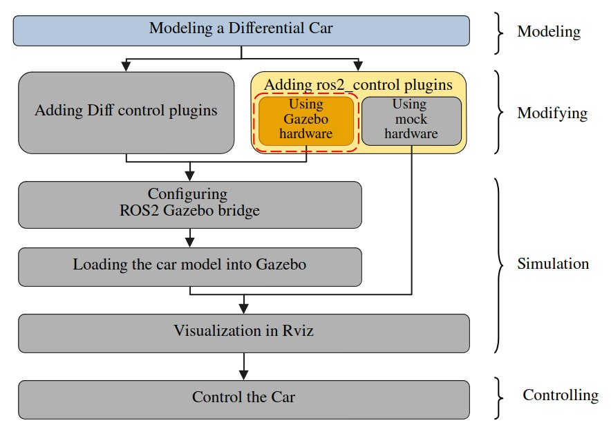
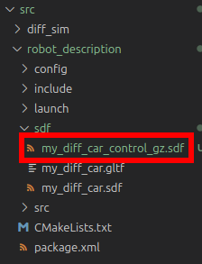
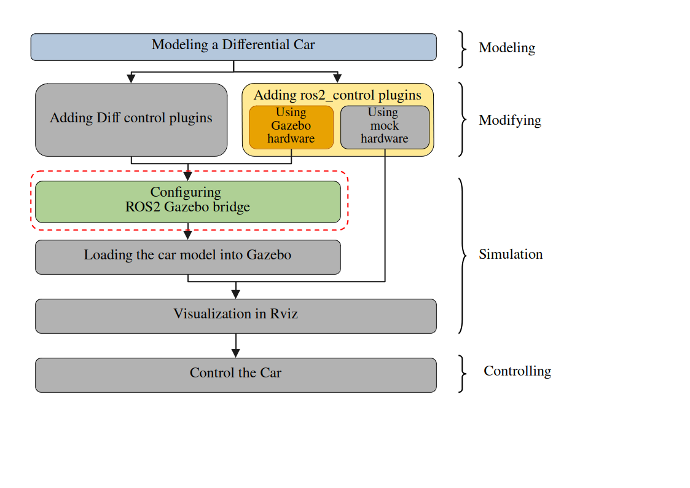
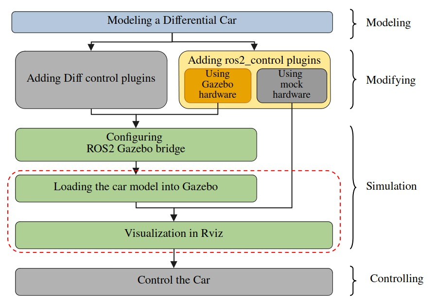
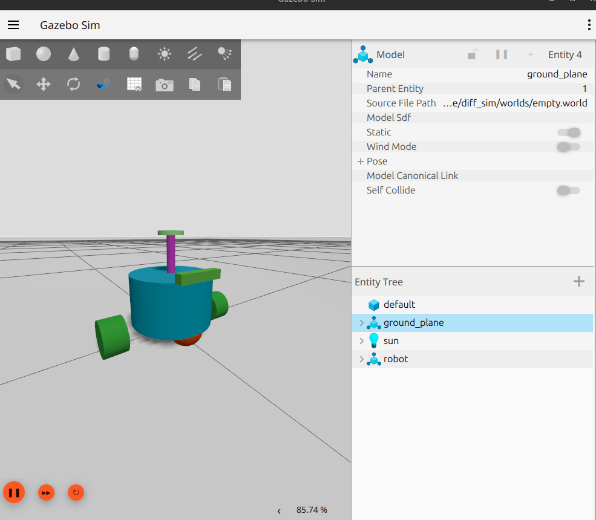
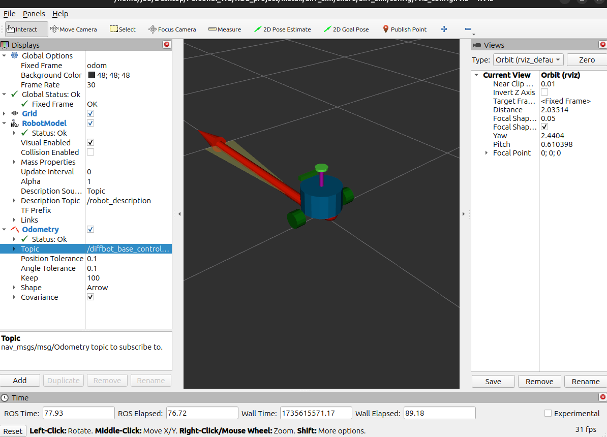
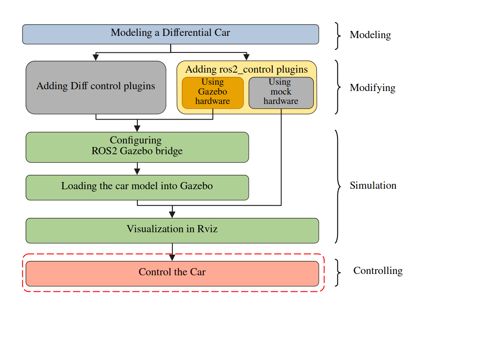
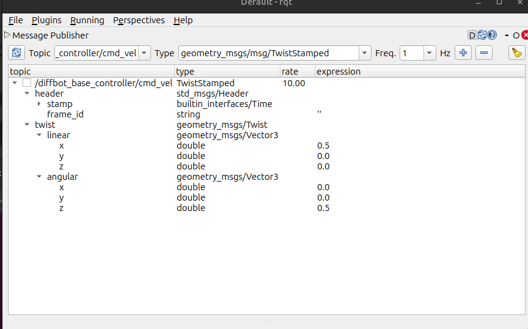

## Introduction

### Serial intro
This serial introducing a complete workflow, introducing how to simulate a differential car model in Gazebo Harmonic. No hardware is requested in this tutorial, but you can add hardware easily later. The serial's syllabus is shown below.


The software used are listed below:

| Software     | Version                       |
| ------------ | ----------------------------- |
| OS           | Ubuntu 24.04                  |
| ROS          | Jazz Jalisco                  |
| ros2_control | 4.20.0-1noble.20241118.193738 |
| Gazebo       | Harmonic                      |
| Rviz         | 14.1.5-1noble.20241115.194822 |

Source code could be found [here](https://github.com/JuuHuu/ROS_DiffCar_example)

### About this tutorial
In this tutorial, we will modify the differential car model to use ros2_control framework and Gazebo interface, detailed introduction about ros2_control can be found on official [page](https://control.ros.org/jazzy/index.html).

## Modifying

### Section overview


Since we have already build a differential car model in last [tutorial](https://juuhuu.github.io/blog/posts/20241229_diff_drive/), we will modify the model to use ros2_control.

### Tools
- VS code

### Steps
#### Duplicate a sdf file
Duplicate [my_diff_car.sdf](https://github.com/JuuHuu/ROS_DiffCar_example/blob/365ea3da55ae5d60574c2b51b32f55816f523075/src/robot_description/sdf/my_diff_car.sdf) file in robot_description package, give it a new name: `my_diff_car_control_gz.sdf`. After that, you should have two different robot description file.


#### Delete Original plugins
Delete the `joint state publisher` and `differential drive` plugin. We will use ros2_control to control the car and the controller has joint state publish function, so we do not need the plugin now.

#### Add ros2_control and gazebo plugin
At ros2_control and Gazebo plugin inside the model tag (where the original plugin should be):
```xml
<ros2_control name="robot" type="system">
    <hardware>
        <plugin>gz_ros2_control/GazeboSimSystem</plugin>
    </hardware>
    <joint name="base_link_to_right_wheel">
        <command_interface name="velocity"/>
        <state_interface name="position"/>
        <state_interface name="velocity"/>
    </joint>
    <joint name="base_link_to_left_wheel">
        <command_interface name="velocity"/>
        <state_interface name="position"/>
        <state_interface name="velocity"/>
    </joint>
</ros2_control>

<plugin name="gz_ros2_control::GazeboSimROS2ControlPlugin" filename="libgz_ros2_control-system">
    <parameters>PARAMETERS_CONFIG_FILE_PLACEHOLDER</parameters>
</plugin>
```

Here we place a `PARAMETERS_CONFIG_FILE_PLACEHOLDER` in stead of a real config file path, We will replace it in the launch file, so that we can use different control config file. We also use a `<plugin>gz_ros2_control/GazeboSimSystem</plugin>` as the ros2_control hardware, this allows to use gazebo to simulation the ros2_control, it can be replaced by a mock hard, which we will introduce later, or a real robot hardware.

#### Add ros2_control config file
Open our diff_sim package, create a new file in the config folder named: `diff_drive_controller.yaml`, fill following content:
```yaml
controller_manager:
  ros__parameters:
    update_rate: 20 # Hz
    use_sim_time: true

    joint_state_broadcaster:
      type: joint_state_broadcaster/JointStateBroadcaster

diffbot_base_controller:
  ros__parameters:
    type: diff_drive_controller/DiffDriveController
    left_wheel_names: ["base_link_to_left_wheel"]
    right_wheel_names: ["base_link_to_right_wheel"]

    wheel_separation: 0.3
    #wheels_per_side: 1  # actually 2, but both are controlled by 1 signal
    wheel_radius: 0.04

    wheel_separation_multiplier: 1.0
    left_wheel_radius_multiplier: 1.0
    right_wheel_radius_multiplier: 1.0

    publish_rate: 50.0
    odom_frame_id: odom
    base_frame_id: base_footprint
    pose_covariance_diagonal: [0.001, 0.001, 0.0, 0.0, 0.0, 0.01]
    twist_covariance_diagonal: [0.001, 0.0, 0.0, 0.0, 0.0, 0.01]

    open_loop: true
    enable_odom_tf: true

    cmd_vel_timeout: 0.5
    #publish_limited_velocity: true
    #velocity_rolling_window_size: 10

    # Velocity and acceleration limits
    # Whenever a min_* is unspecified, default to -max_*
    linear.x.has_velocity_limits: true
    linear.x.has_acceleration_limits: true
    linear.x.max_velocity: 1.0
    linear.x.min_velocity: -1.0
    linear.x.max_acceleration: 1.0
    linear.x.max_jerk: .NAN
    linear.x.min_jerk: .NAN

    angular.z.has_velocity_limits: true
    angular.z.has_acceleration_limits: true
    angular.z.max_velocity: 1.0
    angular.z.min_velocity: -1.0
    angular.z.max_acceleration: 1.0
    angular.z.min_acceleration: -1.0
    angular.z.max_jerk: .NAN
    angular.z.min_jerk: .NAN

```
We have a `controller manager`and a `diffbot_base_controller`. The `controller manager` config the parameters of controller manager, and load the `joint_state_publisher controller`; `diffbot_base_controller` config the differential controller. Detailed parameter explanation can be found [here](https://control.ros.org/jazzy/doc/ros2_controllers/diff_drive_controller/doc/userdoc.html).

I feel a little bit confused here when using ros2_control for the first. In the last tutorial, we have already used a differential controller plugin directly, and why we bother to use a ros2_control to start a control manager then using it to load a differential controller here. It turns out that using control manager allows more flexibility in loading controllers. We could load, config or unload controller at runtime. And ros2_control provide a set of controller that we can use to.

## Config bridge
### Section overview


### Tools
- VS code

### Steps
Duplicate `bridge_config.yaml` and give it a new name `bridge_config_control_gz.yaml`. delete bridge config below:
- joint_states
- odom
- tf
- cmd_vel
 
all above topic will be automatically published by the controller manager. Check out `diff_drive_controller.yaml` again, you will find all above topic have been config in the file.

## Load model into Gazebo and visualize in Rviz
### Section overview


### Tools
- VS code

### Steps

#### create the launch file
Create a lunch file in launch folder named  `sim_control_gz.launch.py`, fill following content:
```python
from launch import LaunchDescription
from launch.actions import DeclareLaunchArgument
from launch_ros.actions import Node
from launch.actions import IncludeLaunchDescription, RegisterEventHandler
from launch.launch_description_sources import PythonLaunchDescriptionSource
from launch.event_handlers import OnProcessExit
import os
from ament_index_python.packages import get_package_share_directory


def generate_launch_description():

    # Get the package share directory
    robot_description = get_package_share_directory("robot_description")
    simulation_package = get_package_share_directory("diff_sim")

    # Define the path to RViz, and SDF files
    rviz_file = os.path.join(simulation_package, "config", "rviz_config.rviz")
    gazebo_launch_file = os.path.join(
        get_package_share_directory("ros_gz_sim"), "launch", "gz_sim.launch.py"
    )
    sdf_file = os.path.join(robot_description, "sdf", "my_diff_car_control_gz.sdf")

    # Path to controller file
    controller_config_path = os.path.join(
        simulation_package,
        "config",
        "diff_drive_controller.yaml",
    )

    # Read the robot description file
    robot_description_content = open(sdf_file, "r").read()

    # replace the PARAMETERS_CONFIG_FILE_PLACEHOLDER with controller
    robot_description_content = (
        open(sdf_file, "r")
        .read()
        .replace("PARAMETERS_CONFIG_FILE_PLACEHOLDER", controller_config_path)
    )

    robot_description = {"robot_description": robot_description_content}

    # bridge config file
    bridge_params = os.path.join(
        simulation_package,
        "config",
        "bridge_config_control_gz.yaml",
    )

    joint_state_broadcaster_spawner = Node(
        package="controller_manager",
        executable="spawner",
        arguments=["joint_state_broadcaster"],
    )

    robot_controller_spawner = Node(
        package="controller_manager",
        executable="spawner",
        arguments=[
            "diffbot_base_controller",
            "--param-file",
            controller_config_path,
        ],
    )

    # Define the robot_state_publisher node
    robot_state_publisher_node = Node(
        package="robot_state_publisher",
        executable="robot_state_publisher",
        output="screen",
        parameters=[robot_description],
    )

    # Define the RViz node
    rviz_node = Node(
        package="rviz2",
        executable="rviz2",
        name="rviz2",
        output="screen",
        arguments=["-d", rviz_file],
        parameters=[{"use_sim_time": True}],
    )

    world = "empty.world"
    world_file = os.path.join(simulation_package, "worlds", world)

    # Define the Gazebo node server
    gazebo_node = IncludeLaunchDescription(
        PythonLaunchDescriptionSource(gazebo_launch_file),
        launch_arguments={
            "gz_args": [" -r -s -v4 ", world_file],
            "on_exit_shutdown": "true",
        }.items(),
    )

    # Gazebo GUI
    gzclient_cmd = IncludeLaunchDescription(
        PythonLaunchDescriptionSource(os.path.join(gazebo_launch_file)),
        launch_arguments={"gz_args": "-g -v4 "}.items(),
    )

    # Define the spawn_entity node to spawn the robot in Gazebo
    spawn_entity_node = Node(
        package="ros_gz_sim",
        executable="create",
        arguments=[
            "-topic",
            "/robot_description",
            "-name",
            "robot",
        ],
        output="screen",
    )

    start_gazebo_ros_bridge_cmd = Node(
        package="ros_gz_bridge",
        executable="parameter_bridge",
        arguments=[
            "--ros-args",
            "-p",
            f"config_file:={bridge_params}",
        ],
        output="screen",
    )

    delay_rviz_after_joint_state_broadcaster_spawner = RegisterEventHandler(
        event_handler=OnProcessExit(
            target_action=joint_state_broadcaster_spawner,
            on_exit=[rviz_node],
        )
    )
    delay_joint_state_broadcaster_after_robot_controller_spawner = RegisterEventHandler(
        event_handler=OnProcessExit(
            target_action=robot_controller_spawner,
            on_exit=[joint_state_broadcaster_spawner],
        )
    )

    return LaunchDescription(
        [
            DeclareLaunchArgument(
                "use_sim_time",
                default_value="true",
                description="Use simulation (Gazebo) clock if true",
            ),
            robot_state_publisher_node,
            robot_controller_spawner,
            gazebo_node,
            gzclient_cmd,
            spawn_entity_node,
            start_gazebo_ros_bridge_cmd,
            delay_joint_state_broadcaster_after_robot_controller_spawner,
            delay_rviz_after_joint_state_broadcaster_spawner,
        ]
    )

```

Comparing to the launch file in last tutorial, we add some controller config file and load the control.

#### compile and run
Compile the project and run. You will see Gazebo and Rviz is launched.



## Control the car
### Section overview


### Tools
- VS code

### Steps
You can visualize all sensor date identical to the last tutorial. But control topic changed when using ros2_control. It uses a topic `/diffbot_base_controller/cmd_vel` with type `geometry_msgs/msg/TwistStamped` to control the car. You will have two choices to control it

#### Using topic to control the car
launch `rqt`, in `Message Publisher` add topic `/diffbot_base_controller/cmd_vel` you will find the topic has a extra header parameters. Setting linear.x velocity and angular.z velocity, the car in Gazebo and Rviz is moving.


#### Using game pad to control the car
Open a new terminal run following command:
```bash
ros2 launch teleop_twist_joy teleop-launch.py joy_config:=xbox publish_stamped_twist:=true joy_vel:=/diffbot_base_controller/cmd_vel
```
You can find that we add some extra parameters to config the header and topic. Connecting the game pad you will find the car is moving in Gazebo and Rviz.