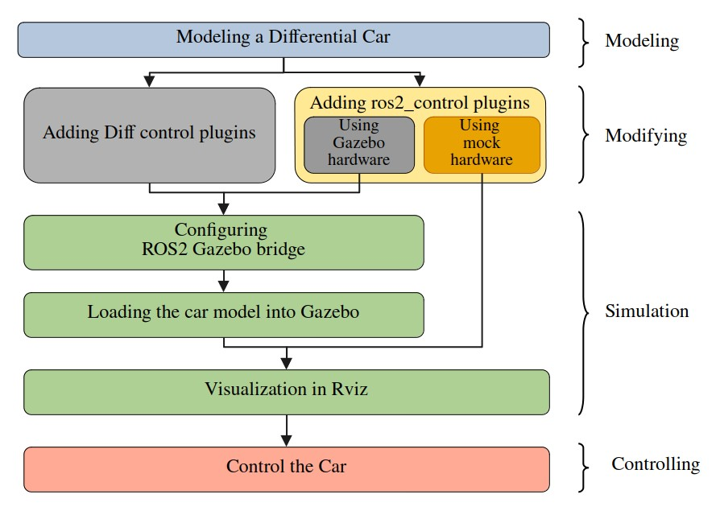

## Introduction

### Serial intro
This serial introducing a complete workflow, introducing how to simulate a differential car model in Gazebo Harmonic. No hardware is requested in this tutorial, but you can add hardware easily later. The serial's syllabus is shown below.



The software used are listed below:

| Software     | Version                       |
| ------------ | ----------------------------- |
| OS           | Ubuntu 24.04                  |
| ROS          | Jazz Jalisco                  |
| ros2_control | 4.20.0-1noble.20241118.193738 |
| Gazebo       | Harmonic                      |
| Rviz         | 14.1.5-1noble.20241115.194822 |

Source code could be found [here](https://github.com/JuuHuu/ROS_DiffCar_example)

### About this tutorial
In this tutorial, we will modify the differential car model to use ros2_control framework and mock interface, detailed introduction about ros2_control can be found on official [page](https://control.ros.org/jazzy/index.html). 

### tutorial overview
The code used in this tutorial are quiet similar to the control the car using ros2_control in Gazebo. For simplicity, we will introduce how to modify last tutorial's code to using mock hardware.


## Steps
### Modify robot description sdf file
Duplicate `my_diff_car_control_gz.sdf`, give it a new name: `my_diff_car_control_mock.sdf`. 

Delete `gz-ros2_control plugin`, and change `hardware` in ros2_control to this:
```xml
<hardware>
    <plugin>mock_components/GenericSystem</plugin>
</hardware>
```
We will not use gazebo to sim the robot, so we delete the gazebo related plugin. And we will use a mock hardware to do the control. The mock hardware can be extended to a real hardware to control real robot.

After modification your robot description should looks like:


### Modify diff_derive_controller.yaml
Duplicate `diff_derive_controller.yaml`, give it a new name: `diff_derive_controller_mock.yaml`. Delete the  `use_sim_time: true` , since we do not have simulation.

### Modify the launch file
build a new launch file fill following:
```python
from launch import LaunchDescription
from launch.actions import DeclareLaunchArgument
from launch_ros.actions import Node
from launch.actions import RegisterEventHandler
from launch.event_handlers import OnProcessExit
import os
from ament_index_python.packages import get_package_share_directory


def generate_launch_description():

    # Get the package share directory
    robot_description = get_package_share_directory("robot_description")
    simulation_package = get_package_share_directory("diff_sim")

    # Define the path to RViz, and SDF files
    rviz_file = os.path.join(simulation_package, "config", "rviz_config.rviz")
    sdf_file = os.path.join(robot_description, "sdf", "my_diff_car_control_mock.sdf")

    # Path to controller file
    controller_config_path = os.path.join(
        simulation_package,
        "config",
        "diff_drive_controller_mock.yaml",
    )

    # Read the robot description file
    robot_description_content = open(sdf_file, "r").read()

    robot_description = {"robot_description": robot_description_content}

    control_node = Node(
        package="controller_manager",
        executable="ros2_control_node",
        parameters=[controller_config_path],
        output="both",
    )

    joint_state_broadcaster_spawner = Node(
        package="controller_manager",
        executable="spawner",
        arguments=["joint_state_broadcaster"],
    )

    robot_controller_spawner = Node(
        package="controller_manager",
        executable="spawner",
        arguments=[
            "diffbot_base_controller",
            "--param-file",
            controller_config_path,
        ],
    )

    # Define the robot_state_publisher node
    robot_state_publisher_node = Node(
        package="robot_state_publisher",
        executable="robot_state_publisher",
        output="screen",
        parameters=[robot_description],
    )

    # Define the RViz node
    rviz_node = Node(
        package="rviz2",
        executable="rviz2",
        name="rviz2",
        output="screen",
        arguments=["-d", rviz_file],
        parameters=[{"use_sim_time": True}],
    )

    delay_rviz_after_joint_state_broadcaster_spawner = RegisterEventHandler(
        event_handler=OnProcessExit(
            target_action=joint_state_broadcaster_spawner,
            on_exit=[rviz_node],
        )
    )
    delay_joint_state_broadcaster_after_robot_controller_spawner = RegisterEventHandler(
        event_handler=OnProcessExit(
            target_action=robot_controller_spawner,
            on_exit=[joint_state_broadcaster_spawner],
        )
    )

    return LaunchDescription(
        [
            DeclareLaunchArgument(
                "use_sim_time",
                default_value="true",
                description="Use simulation (Gazebo) clock if true",
            ),
            control_node,
            robot_state_publisher_node,
            robot_controller_spawner,
            delay_joint_state_broadcaster_after_robot_controller_spawner,
            delay_rviz_after_joint_state_broadcaster_spawner,
        ]
    )

```
In the launch file, we delete all nodes and config related to Gazebo. And add a `control node` to manage the controller.


### Compile and run
Compile and run the launch file, Rviz should started. And we can use publishing topic or game pad to control the car.
